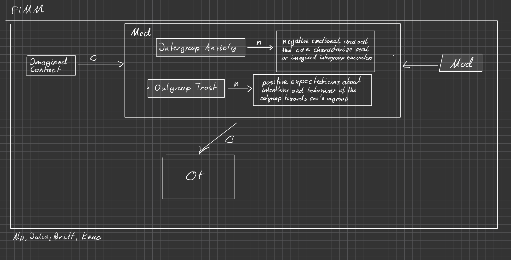

# Summary of Literature Search for Mediating Affective Processes
## Definitions
Following Turner, Crisp, & Lambert (2007, p.2), we define **Intergroup Anxiety** as "negative emotional arousal that can characterize *real or imagined* intergroup encounters". Here, the italicized words are a deviation from the original authors' definition to fit the theory of *imagined* contact.

Directly adopting from Crisp & Turner (2012, p. 151) we define **Outgroup Trust** as "positive expectations about intentions and behaviour of the outgroup towards one's ingroup".

### VAST Display

## Assessment of Robustness
In the following section, we assess the robustness of the theoreticaly-assumed effects of **Intergroup Anxiety** and **Outgroup Trust** as mediators for the effect of imagined intergroup contact on outcome variables. For this we focus on the evidence for the **effect** and the **generilisability** (using the UTOS framework [citation needed]).

### Intergroup Anxiety
Considering the work from Turner et al. (2013), Husnu & Crisp (2010) and Turner et al. (2007), it can be concluded that the **effects** of intergroup anxiety as a mediator between imagined contact and different operationalisations of attitudes towards outgroups are negative (i.e. reduced intergroup anxiety) but highly heterogenous (e.g., d = 1.49, d = 0.6). 

TODO: direction? 

Studies did not report effect sizes of mediating effects or not in a way they could be clearly assigned to specific effects nor did they offer sufficient information to calculate them (???). Significance tests on the mediation were signficant most of the time but not always, sometimes depending on the outcome variable. Thus, the evidence for the effect is inconclusive.

TODO Unk

The **generalisability** across the **Unit** dimension is limited because samples are overall small (n = 27-60), consisting of a limited age-group by only drawing from high-school or college students. **Treatments** varied slightly in regard of the characteristics of the imagined outgroup (gay men and British Muslims). 
**Outcomes** for which the mediating effect was assessed were diverse, including positive outgroup evaluations and perceived outgroup variability (Turner et al., 2007, Exp. 3), tendency to approach the outgroup (Turner et al., 2013, Exp. 2) as well as intention to engange in future contact (Husnu & Crisp, 2010, Exp. 2). There were no information given about the **Setting**.

Given the evidence, **the mediating effect of Intergroup Anxiety can not be considered robust** due to heterogenity of the effect and low or unknown generalisability, especially because of very small samples drawn from a homogeneous population.

### Outgroup Trust
Considering the work from Vezzali et al. (2012) and Turner et al. (2013), it can be concluded that the **effects** of outgroup trust as a mediator between imagined contact and different operationalisations of attitudes towards outgroups are positive but heterogenous, ranging from small to rather large effect sizes. 
The studies showcase the same flaws as described in [Intergroup Anxiety](#intergroup-anxiety). Thus, the evidence for the effect sizes is inconclusive.

The **generalisability** across the **Unit** dimension is limited because samples are overall small (n = 34-41), consisting of a limited age-group, although slighty more diverse than in [Intergroup Anxiety](#intergroup-anxiety) by including fourth-graders. **Treatments** varied slightly in regard of the characteristics of the imagined outgroup (Assylum seekers, gay men and immigrant children). **Outcomes** included appraoch and avoid behavioral tendency (Turner et al., 2013, Exp. 1 and 2) and attribution of human emotions towards the outgroup and behavioral intentions (Vezzali et al., 2012). There were again no information pertaining to the **Setting** of the individual studies.

Given the evidence, **the mediating effect of Outgroup Trust can not be considered robust** due to heterogenity of the effect and low generalisability, especially because of very small sample sizes.

## Sources
Crisp, R. J., & Turner, R. N. (2012). The Imagined Contact Hypothesis. In J. M. Olson & M. P. Zanna (Eds.), Advances in Experimental Social Psychology (Vol. 46, pp. 125–182). Academic Press. https://doi.org/10.1016/B978-0-12-394281-4.00003-9

Husnu, S., & Crisp, R. J. (2010). Elaboration enhances the imagined contact effect. Journal of Experimental Social Psychology, 46(6), 943–950. https://doi.org/10.1016/j.jesp.2010.05.014

Turner, R. N., Crisp, R. J., & Lambert, E. (2007). Imagining Intergroup Contact Can Improve Intergroup Attitudes. Group Processes & Intergroup Relations, 10(4), 427–441. https://doi.org/10.1177/1368430207081533

Turner, R. N., West, K., & Christie, Z. (2013). Out-group trust, intergroup anxiety, and out-group attitude as mediators of the effect of imagined intergroup contact on intergroup behavioral tendencies. Journal of Applied Social Psychology, 43(S2), E196–E205. https://doi.org/10.1111/jasp.12019

Vezzali, L., Capozza, D., Stathi, S., & Giovannini, D. (2012). Increasing outgroup trust, reducing infrahumanization, and enhancing future contact intentions via imagined intergroup contact. Journal of Experimental Social Psychology, 48(1), 437–440. https://doi.org/10.1016/j.jesp.2011.09.008

