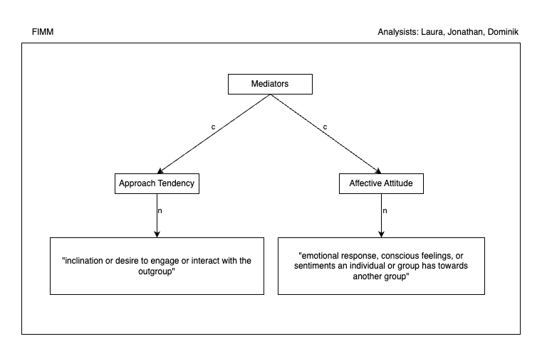

# Affective Attitude

## Working Definition

refers to the emotional response, conscious feelings, or sentiments an individual or group has towards another group

## Theoretical Findings

**Tropp & Pettigrew (2005) http://dx.doi.org/10.1177/0146167205274854**

Propose that attitudes toward outgroup (synonym: prejudice) consists of two dimensions:

- affective dimensions of prejudice (emotions, favorability, and liking) (p. 1151 and 1152)
  - Emotions: Participants reported the extent to which they would expect to feel ten different emotional states when interacting with a outgroup person person
  - Favorability: participants indicated how they feel toward outgroup people
  - Anticipated liking in interactions (e.g. I think I would enjoy interactions with outgroup people)
- cognitive dimensions of prejudice (stereotypes, beliefs, and judgments) (p. 1151)

> Those prejudice indicators based on affective dimensions show significant and more consistent relationships with intergroup contact, relative to the effects obtained with cognitively based indicators. (p.1154)

## Empirical Findings

**Boehm et al. (2010) http://dx.doi.org/10.2304/elea.2010.7.2.133**

> Therefore we reject our hypothesis that participation in a six-week student online collaborative project, conducted with different samples over a period of six semesters, has a statistically significant effect on decreasing ethnocentrism levels in either the American or the Polish student samples (p. 140).

- U: 204 in experimental conditions, 459 in control conditions
- T: online collaboration between international college students
- O: Measured construct "Ethnocentrism" = tendency to look at the world primarily from the perspective of one’s own (p. 134)
  - Instrument: Generalized Ethnocentrism or GENE scale (James Neuliep & James McCroskey, 1997)
  - sample items: "Most other cultures are backward compared to my culture", "Lifestyles in other cultures are just as valid as those in my culture. "
- S: quasi-experimental study in two countries

**Verdict**: ethnocentrism focuses more on cognitive aspects of attitude towards the outgroup and the study examined direct contact with the outgroup in online collaboration tasks. Therefore, the results form this study do not help to gauge the effect size of imagined contact on affective attitude as per our working definition.

**Al Ramiah (2012) http://dx.doi.org/10.1111/j.2044-8309.2011.02041.x**

Measured construct:
CAVE: instruments are developed for this study, although adapted from other

- U:
- T:
- O: Participants completed measures of outgroup attitudes and stereotypes that were combined to form an outgroup evaluations measure (p. 246)
  - outgroup attitude: "extent to which they liked the outgroup" , "how positive they felt towards the outgroup"
  - stereotype: "extent to which they thought outgroup members were friendly, warm, trustworthy, competent, hardworking, andintelligent"
- S:

# Approach Tendency

## Working Definition

inclination or desire to engage or interact with the outgroup

## Theoretical Findings

## Empirical Findings

Study 1:
U
T
O
S

Study 2:
U
T
O
S

# VAST Display

